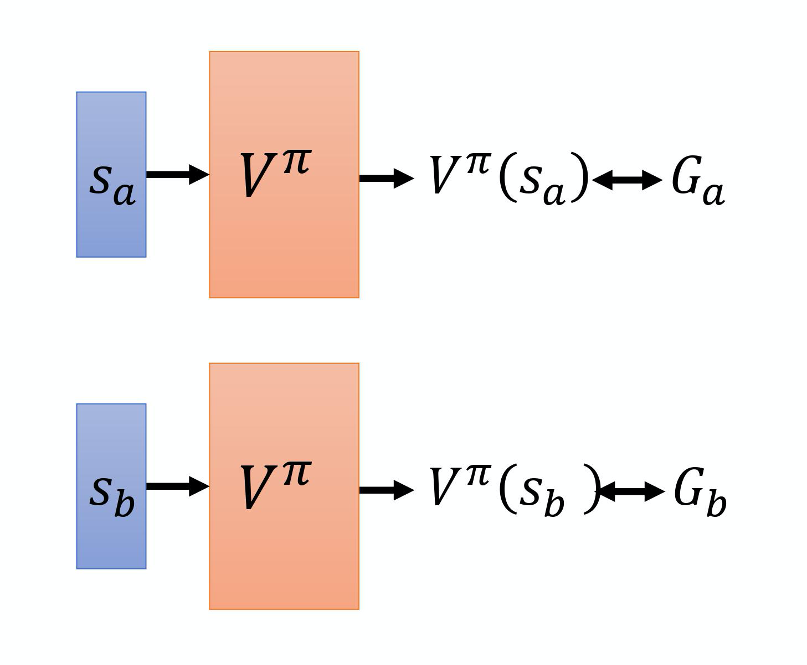
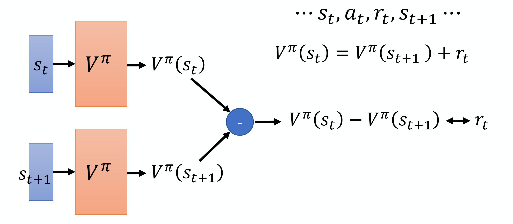
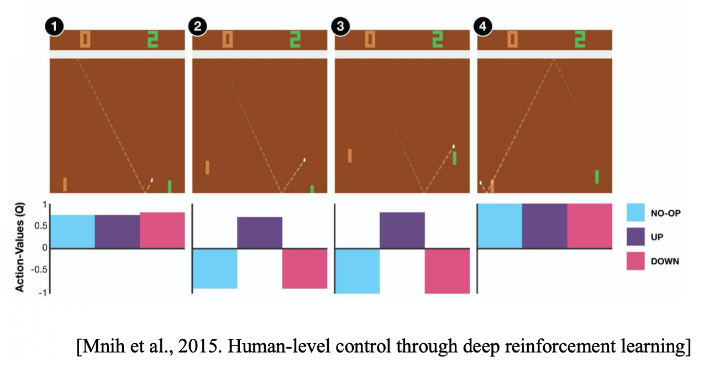
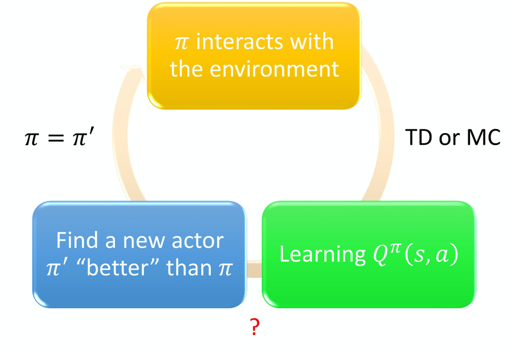
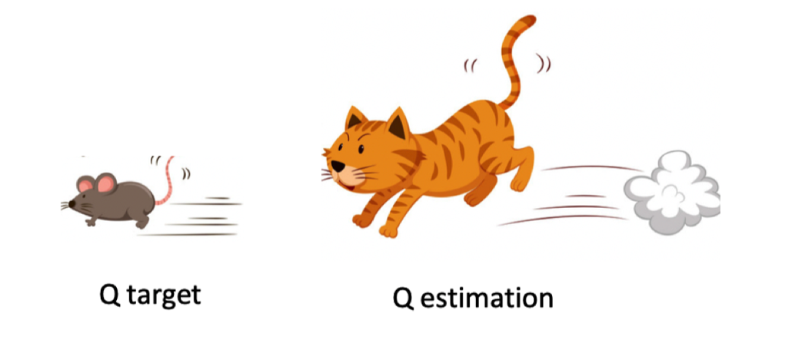
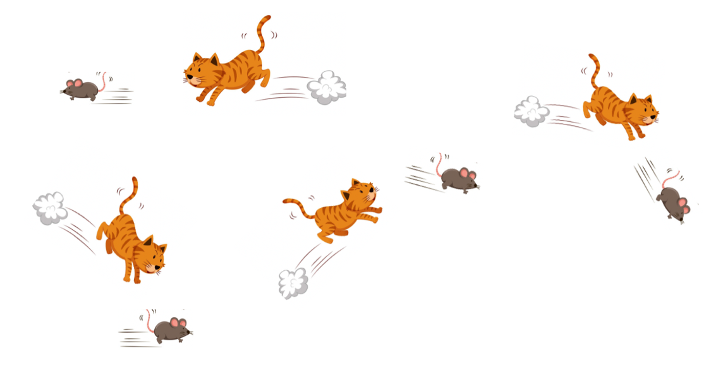
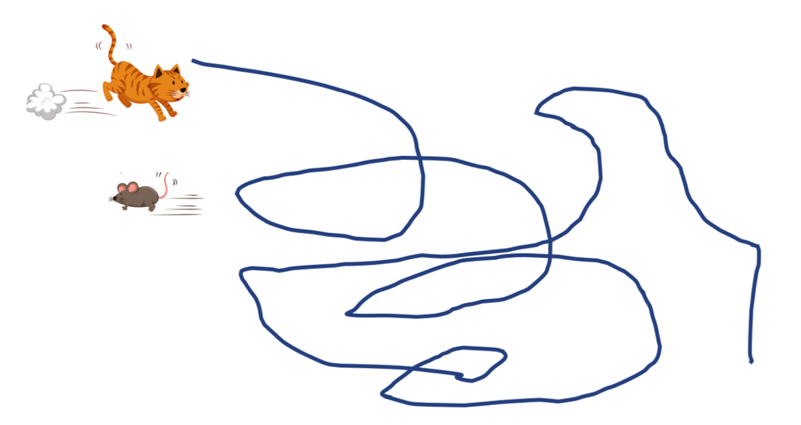

# DQN
为了在连续的状态和动作空间中计算值函数 $Q^{\pi}(s,a)$，我们可以用一个函数 $Q_{\phi}(\boldsymbol{s},\boldsymbol{a})$ 来表示近似计算，称为`价值函数近似(Value Function Approximation)`。
$$
Q_{\phi}(\boldsymbol{s}, \boldsymbol{a}) \approx Q^{\pi}(s, a)
$$

其中
* $\boldsymbol{s},\boldsymbol{a}$ 分别是状态 $s$ 和动作 $a$ 的向量表示，
* 函数 $Q_{\phi}(\boldsymbol{s}, \boldsymbol{a})$ 通常是一个参数为 $\phi$ 的函数，比如`神经网络`，输出为一个实数，称为`Q 网络(Q-network)`。

## State Value Function

**Q-learning 是 `value-based` 的方法。在 value-based 的方法里面，我们学习的不是策略，我们要学习的是一个 `critic(评论家)`。**评论家要做的事情是评价现在的行为有多好或是有多不好。假设有一个演员(actor) $\pi$ ，评论家就是来评价这个演员的策略 $\pi$  好还是不好，即 `Policy Evaluation(策略评估)`。

> 注：「李宏毅深度强化学习」课程提到的 Q-learning，其实是 DQN(Deep Q-network)。
>
> DQN 是指基于深度学习的 Q-learning 算法，主要结合了`价值函数近似(Value Function Approximation)`与神经网络技术，并采用了目标网络和经历回放的方法进行网络的训练。
>
> 在 Q-learning 中，我们使用表格来存储每个状态 s 下采取动作 a 获得的奖励，即状态-动作值函数 $Q(s,a)$。然而，这种方法在状态量巨大甚至是连续的任务中，会遇到维度灾难问题，往往是不可行的。因此，DQN 采用了价值函数近似的表示方法。

举例来说，有一种评论家叫做 `state value function(状态价值函数)`。状态价值函数的意思就是说，假设演员叫做 $\pi$，拿 $\pi$  跟环境去做互动。假设 $\pi$  看到了某一个状态 s，如果在玩 Atari 游戏的话，状态 s 是某一个画面，看到某一个画面的时候，接下来一直玩到游戏结束，期望的累积奖励有多大。所以 $V^{\pi}$ 是一个函数，这个函数输入一个状态，然后它会输出一个标量( scalar)。这个标量代表说，$\pi$ 这个演员看到状态 s 的时候，接下来预期到游戏结束的时候，它可以得到多大的值。

举个例子，假设你是玩 space invader 的话，

* 左边这个状态 s，这个游戏画面，$V^{\pi}(s)$  也许会很大，因为还有很多的怪可以杀， 所以你会得到很大的分数。一直到游戏结束的时候，你仍然有很多的分数可以吃。
* 右边这种情况你得到的 $V^{\pi}(s)$ 可能就很小，因为剩下的怪也不多了，并且红色的防护罩已经消失了，所以可能很快就会死掉。所以接下来得到预期的奖励，就不会太大。

这边需要强调的一个点是说，评论家都是绑一个演员的，评论家没有办法去凭空去评价一个状态的好坏，它所评价的东西是在给定某一个状态的时候， 假设接下来互动的演员是 $\pi$，那我会得到多少奖励。因为就算是给同样的状态，你接下来的 $\pi$ 不一样，你得到的奖励也是不一样的。

举例来说，在左边的情况，假设是一个正常的 $\pi$，它可以杀很多怪，那假设它是一个很弱的 $\pi$，它就站在原地不动，然后马上就被射死了，那你得到的 $V^\pi(s)$ 还是很小。所以评论家的输出值取决于状态和演员。所以评论家其实都要绑一个演员，它是在衡量某一个演员的好坏，而不是衡量一个状态的好坏。这边要强调一下，评论家的输出是跟演员有关的，状态的价值其实取决于你的演员，当演员变的时候，状态价值函数的输出其实也是会跟着改变的。

### State Value Function Estimation

**怎么衡量这个状态价值函数 $V^{\pi}(s)$ 呢？**有两种不同的做法：MC-based 的方法和 TD-based 的方法。

` Monte-Carlo(MC)-based`的方法就是让演员去跟环境做互动，你要看演员好不好， 你就让演员去跟环境做互动，给评论家看。然后，评论家就统计说，

* 演员如果看到状态 $s_a$，接下来的累积奖励会有多大。
* 如果它看到状态 $s_b$，接下来的累积奖励会有多大。

但是实际上，你不可能把所有的状态通通都扫过。如果你是玩 Atari 游戏的话，状态是图像，你没有办法把所有的状态通通扫过。所以实际上 $V^{\pi}(s)$ 是一个网络。对一个网络来说，就算输入状态是从来都没有看过的，它也可以想办法估测一个值的值。

怎么训练这个网络呢？因为如果在状态 $s_a$，接下来的累积奖励就是 $G_a$。也就是说，对这个价值函数来说，如果输入是状态 $s_a$，正确的输出应该是 $G_a$。如果输入状态 $s_b$，正确的输出应该是值 $G_b$。**所以在训练的时候， 它就是一个 `回归问题(regression problem)`。**网络的输出就是一个值，你希望在输入 $s_a$ 的时候，输出的值跟 $G_a$ 越近越好，输入 $s_b$ 的时候，输出的值跟 $G_b$ 越近越好。接下来把网络训练下去，就结束了。这是 MC-based 的方法。

**第二个方法是`Temporal-difference(时序差分)` 的方法， `即 TD-based ` 的方法。**

在 MC-based 的方法中，每次我们都要算累积奖励，也就是从某一个状态 $s_a$ 一直玩到游戏结束的时候，得到的所有奖励的总和。所以你要使用 MC-based 的方法，你必须至少把这个游戏玩到结束。但有些游戏非常长，你要玩到游戏结束才能够更新网络，花的时间太长了，因此我们会采用 TD-based 的方法。

TD-based 的方法不需要把游戏玩到底，只要在游戏的某一个情况，某一个状态 $s_t$ 的时候，采取动作 $a_t$ 得到奖励$r_t$ ，跳到状态 $s_{t+1}$，就可以使用 TD 的方法。

怎么使用 TD 的方法呢？这边是基于以下这个式子：
$$
V^{\pi}\left(s_{t}\right)=V^{\pi}\left(s_{t+1}\right)+r_{t}
$$

假设我们现在用的是某一个策略$\pi$，在状态 $s_t$，它会采取动作 $a_t$，给我们奖励 $r_t$ ，接下来进入 $s_{t+1}$ 。状态 $s_{t+1}$ 的值跟状态 $s_t$ 的值，它们的中间差了一项 $r_t$。因为你把 $s_{t+1}$ 得到的值加上得到的奖励 $r_t$ 就会等于 $s_t$ 得到的值。有了这个式子以后，你在训练的时候，你并不是直接去估测 V，而是希望你得到的结果 V 可以满足这个式子。

也就是说你会是这样训练的，你把 $s_t$ 丢到网络里面，因为 $s_t$ 丢到网络里面会得到 $V^{\pi}(s_t)$，把 $s_{t+1}$ 丢到你的值网络里面会得到 $V^{\pi}(s_{t+1})$，这个式子告诉我们，$V^{\pi}(s_t)$ 减 $V^{\pi}(s_{t+1})$ 的值应该是 $r_t$。然后希望它们两个相减的 loss 跟 $r_t$ 越接近，训练下去，更新 V 的参数，你就可以把 V function 学习出来。

**MC 跟 TD 有什么样的差别呢？**

**MC 最大的问题就是方差很大。**因为我们在玩游戏的时候，它本身是有随机性的。所以你可以把 $G_a$ 看成一个随机变量。因为你每次同样走到 $s_a$ 的时候，最后你得到的 $G_a$ 其实是不一样的。你看到同样的状态 $s_a$，最后玩到游戏结束的时候，因为游戏本身是有随机性的，玩游戏的模型搞不好也有随机性，所以你每次得到的 $G_a$ 是不一样的，每一次得到 $G_a$ 的差别其实会很大。为什么它会很大呢？因为 $G_a$ 其实是很多个不同的步骤的奖励的和。假设你每一个步骤都会得到一个奖励，$G_a$ 是从状态 $s_a$ 开始，一直玩到游戏结束，每一个步骤的奖励的和。

举例来说，我在右上角就列一个式子是说，

$$
\operatorname{Var}[k X]=k^{2} \operatorname{Var}[X]
$$
> Var 是指 variance。 

通过这个式子，我们知道 $G_a$ 的方差相较于某一个状态的奖励，它会是比较大的。

如果用 TD 的话，你是要去最小化这样的一个式子：

在这中间会有随机性的是 r。因为计算你在 $s_t$ 采取同一个动作，你得到的奖励也不一定是一样的，所以 r 是一个随机变量。但这个随机变量的方差会比 $G_a$ 还要小，因为 $G_a$ 是很多 r 合起来，这边只是某一个 r  而已。$G_a$ 的方差会比较大，r  的方差会比较小。但是这边你会遇到的**一个问题是你这个 V 不一定估得准**。假设你的这个 V 估得是不准的，那你使用这个式子学习出来的结果，其实也会是不准的。所以 MC 跟 TD 各有优劣。**今天其实 TD 的方法是比较常见的，MC 的方法其实是比较少用的。**

**上图是讲 TD 跟 MC 的差异。**假设有某一个评论家，它去观察某一个策略 $\pi$  跟环境互动的 8 个 episode 的结果。有一个演员 $\pi$  跟环境互动了8 次，得到了8 次玩游戏的结果。接下来这个评论家去估测状态的值。

**我们先计算 $s_b$ 的值。**$s_b$ 这个状态 在 8 场游戏里面都有经历过，其中有 6 场得到奖励 1，有 2 场得到奖励 0。所以如果你是要算期望值的话，就算看到状态 $s_b$ 以后得到的奖励，一直到游戏结束的时候得到的累积奖励期望值是 3/4，计算过程如下式所示：
$$
\frac{6 \times 1 + 2 \times 0}{8}=\frac{6}{8}=\frac{3}{4}
$$
**但 $s_a$ 期望的奖励到底应该是多少呢？**这边其实有两个可能的答案：一个是 0，一个是 3/4。为什么有两个可能的答案呢？这取决于你用 MC 还是TD。用 MC 跟用 TD 算出来的结果是不一样的。

假如你用 MC 的话，你会发现这个 $s_a$ 就出现一次，看到 $s_a$ 这个状态，接下来累积奖励就是 0，所以 $s_a$ 期望奖励就是 0。

但 TD 在计算的时候，它要更新下面这个式子：
$$
V^{\pi}\left(s_{a}\right)=V^{\pi}\left(s_{b}\right)+r
$$

因为我们在状态 $s_a$ 得到奖励 r=0 以后，跳到状态 $s_b$。所以状态 $s_b$ 的奖励会等于状态 $s_b$ 的奖励加上在状态 $s_a$ 跳到状态 $s_b$ 的时候可能得到的奖励 r。而这个得到的奖励 r 的值是 0，$s_b$ 期望奖励是 3/4，那 $s_a$ 的奖励应该是 3/4。

用 MC 跟 TD 估出来的结果很有可能是不一样的。就算评论家观察到一样的训练数据，它最后估出来的结果也不一定是一样的。为什么会这样呢？你可能问说，哪一个结果比较对呢？其实就都对。

因为在第一个 trajectory， $s_a$ 得到奖励 0 以后，再跳到 $s_b$ 也得到奖励 0。这边有两个可能。

* 一个可能是： $s_a$ 是一个标志性的状态，只要看到 $s_a$ 以后，$s_b$ 就会拿不到奖励，$s_a$ 可能影响了 $s_b$。如果是用 MC 的算法的话，它会把 $s_a$ 影响 $s_b$ 这件事考虑进去。所以看到 $s_a$ 以后，接下来 $s_b$ 就得不到奖励，$s_b$ 期望的奖励是 0。

* 另一个可能是：看到 $s_a$ 以后，$s_b$ 的奖励是 0 这件事只是一个巧合，并不是 $s_a$ 所造成，而是因为说 $s_b$ 有时候就是会得到奖励 0，这只是单纯运气的问题。其实平常 $s_b$ 会得到奖励期望值是 3/4，跟 $s_a$ 是完全没有关系的。所以假设 $s_a$ 之后会跳到 $s_b$，那其实得到的奖励按照 TD 来算应该是 3/4。

**所以不同的方法考虑了不同的假设，运算结果不同。**

## State-action Value Function(Q-function)

还有另外一种评论家叫做 `Q-function`。它又叫做`state-action value function(状态-动作价值函数)`。

* 状态价值函数的输入是一个状态，它是根据状态去计算出，看到这个状态以后的期望的累积奖励( expected accumulated reward)是多少。
* 状态-动作价值函数的输入是一个状态、动作对，它的意思是说，在某一个状态采取某一个动作，假设我们都使用演员 $\pi$ ，得到的累积奖励的期望值有多大。

Q-function 有一个需要注意的问题是，这个演员 $\pi$，在看到状态 s 的时候，它采取的动作不一定是 a。Q-function 假设在状态 s 强制采取动作 a。不管你现在考虑的这个演员 $\pi$， 它会不会采取动作 a，这不重要。在状态 s 强制采取动作 a。接下来都用演员 $\pi$ 继续玩下去，就只有在状态 s，我们才强制一定要采取动作 a，接下来就进入自动模式，让演员 $\pi$ 继续玩下去，得到的期望奖励才是 $Q^{\pi}(s,a)$ 。

Q-function 有两种写法：

* 输入是状态跟动作，输出就是一个标量；
* 输入是一个状态，输出就是好几个值。

假设动作是离散的，动作就只有 3 个可能：往左往右或是开火。那这个 Q-function 输出的 3 个值就分别代表 a 是向左的时候的 Q 值，a 是向右的时候的 Q 值，还有 a 是开火的时候的 Q 值。

那你要注意的事情是，上图右边的函数只有离散动作才能够使用。如果动作是无法穷举的，你只能够用上图左边这个式子，不能够用右边这个式子。

上图是文献上的结果，你去估计 Q-function 的话，看到的结果可能如上图所示。假设我们有 3 个动作：原地不动、向上、向下。

* 假设是在第一个状态，不管是采取哪个动作，最后到游戏结束的时候，得到的期望奖励其实都差不多。因为球在这个地方，就算是你向下，接下来你应该还可以急救。所以不管采取哪个动作，都差不了太多。

* 假设在第二个状态，这个乒乓球它已经反弹到很接近边缘的地方，这个时候你采取向上，你才能得到正的奖励，才接的到球。如果你是站在原地不动或向下的话，接下来你都会错过这个球。你得到的奖励就会是负的。

* 假设在第三个状态，球很近了，所以就要向上。

* 假设在第四个状态，球被反弹回去，这时候采取哪个动作就都没有差了。

这是状态-动作价值的一个例子。

虽然表面上我们学习一个 Q-function，它只能拿来评估某一个演员$\pi$ 的好坏，但只要有了这个 Q-function，我们就可以做强化学习。有了这个 Q-function，我们就可以决定要采取哪一个动作，我们就可以进行`策略改进(Policy Improvement)`。

它的大原则是这样，假设你有一个初始的演员，也许一开始很烂，随机的也没有关系。初始的演员叫做 $\pi$，这个 $\pi$ 跟环境互动，会收集数据。接下来你学习一个 $\pi$ 这个演员的 Q 值，你去衡量一下 $\pi$ 在某一个状态强制采取某一个动作，接下来用 $\pi$ 这个策略 会得到的期望奖励，用 TD 或 MC 都是可以的。你学习出一个 Q-function 以后，就保证你可以找到一个新的策略 $\pi'$ ，policy $\pi'$ 一定会比原来的策略 $\pi$ 还要好。那等一下会定义说，什么叫做好。所以假设你有一个 Q-function 和某一个策略 $\pi$，你根据策略 $\pi$ 学习出策略 $\pi$ 的 Q-function，接下来保证你可以找到一个新的策略  $\pi'$ ，它一定会比 $\pi$ 还要好，然后你用 $\pi'$ 取代 $\pi$，再去找它的 Q-function，得到新的以后，再去找一个更好的策略。**这样一直循环下去，policy 就会越来越好。** 

首先要定义的是什么叫做比较好？我们说 $\pi'$ 一定会比 $\pi$ 还要好，什么叫做好呢？这边好是说，对所有可能的状态 s 而言，$V^{\pi^{\prime}}(s) \geq V^{\pi}(s)$。也就是说我们走到同一个状态 s 的时候，如果拿 $\pi$ 继续跟环境互动下去，我们得到的奖励一定会小于用 $\pi'$ 跟环境互动下去得到的奖励。所以不管在哪一个状态，你用 $\pi'$ 去做交互，得到的期望奖励一定会比较大。所以 $\pi'$ 是比 $\pi$  还要好的一个策略。

有了这个 Q-function 以后，怎么找这个 $\pi'$ 呢？如果你根据以下的这个式子去决定你的 动作，
$$
\pi^{\prime}(s)=\arg \max _{a} Q^{\pi}(s, a)
$$

根据上式去决定你的动作的步骤叫做 $\pi'$ 的话，那 $\pi'$ 一定会比 $\pi$ 还要好。这个意思是说，假设你已经学习出 $\pi$ 的 Q-function，今天在某一个状态 s，你把所有可能的动作 a 都一一带入这个 Q-function，看看哪一个 a 可以让 Q-function 的值最大，那这个动作就是 $\pi'$ 会采取的动作。

这边要注意一下，给定这个状态 s，你的策略 $\pi$  并不一定会采取动作a，我们是给定某一个状态 s 强制采取动作 a，用 $\pi$  继续互动下去得到的期望奖励，这个才是 Q-function 的定义。所以在状态 s 里面不一定会采取动作 a。用 $\pi'$ 在状态 s 采取动作 a 跟 $\pi$ 采取的动作是不一定会一样的，$\pi'$ 所采取的动作会让它得到比较大的奖励。

* 所以这个 $\pi'$ 是用 Q-function 推出来的，没有另外一个网络决定 $\pi'$ 怎么交互，有 Q-function 就可以找出 $\pi'$。
* 但是这边有另外一个问题就是，在这边要解一个 arg max 的问题，所以 a 如果是连续的就会有问题。如果是离散的，a 只有 3  个选项，一个一个带进去， 看谁的 Q 最大，没有问题。但如果 a 是连续的，要解 arg max 问题，你就会有问题。

**接下来讲一下为什么用 $Q^{\pi}(s,a)$ 决定出来的 $\pi'$ 一定会比 $\pi$ 好。**

假设有一个策略叫做 $\pi'$，它是由 $Q^{\pi}$ 决定的。我们要证对所有的状态 s 而言，$V^{\pi^{\prime}}(s) \geq V^{\pi}(s)$。

怎么证呢？我们先把 $V^{\pi}(s)$ 写出来：
$$
V^{\pi}(s)=Q^{\pi}(s, \pi(s))
$$
假设在状态 s follow $\pi$ 这个演员，它会采取的动作就是 $\pi(s)$，那你算出来的 $Q^{\pi}(s, \pi(s))$ 会等于 $V^{\pi}(s)$。一般而言，$Q^{\pi}(s, \pi(s))$ 不一定等于 $V^{\pi}(s)$ ，因为动作不一定是 $\pi(s)$。但如果这个动作是 $\pi(s)$ 的话，$Q^{\pi}(s, \pi(s))$ 是等于 $V^{\pi}(s)$ 的。

$Q^{\pi}(s, \pi(s))$ 还满足如下的关系：
$$
Q^{\pi}(s, \pi(s)) \le \max _{a} Q^{\pi}(s, a)
$$

因为 a 是所有动作里面可以让 Q 最大的那个动作，所以今天这一项一定会比它大。这一项就是 $Q^{\pi}(s, a)$，$a$ 就是 $\pi'(s)$。因为 $\pi'(s)$ 输出的 $a$ 就是可以让 $Q^\pi(s,a)$ 最大的那一个，所以我们得到了下面的式子：
$$
\max _{a} Q^{\pi}(s, a)=Q^{\pi}\left(s, \pi^{\prime}(s)\right)
$$

于是：
$$
V^{\pi}(s) \leq Q^{\pi}\left(s, \pi^{\prime}(s)\right)
$$
也就是说某一个状态，如果你按照策略 $\pi$ 一直做下去，你得到的奖励一定会小于等于，在这个状态 s 你故意不按照 $\pi$ 所给你指示的方向，而是按照 $\pi'$ 的方向走一步，但只有第一步是按照 $\pi'$ 的方向走，只有在状态 s 这个地方，你才按照 $\pi'$ 的指示走，接下来你就按照 $\pi$ 的指示走。虽然只有一步之差， 但是从上面这个式子可知，虽然只有一步之差，但你得到的奖励一定会比完全 follow $\pi$ 得到的奖励还要大。

接下来要证下面的式子：
$$
Q^{\pi}\left(s, \pi^{\prime}(s) \right) \le V^{\pi'}(s)
$$

也就是说，只有一步之差，你会得到比较大的奖励。**但假设每步都是不一样的，每步都是 follow $\pi'$ 而不是 $\pi$ 的话，那你得到的奖励一定会更大。**如果你要用数学式把它写出来的话，你可以写成 $Q^{\pi}\left(s, \pi^{\prime}(s)\right)$ ，它的意思就是说，我们在状态 $s_t$ 采取动作 $a_t$，得到奖励 $r_{t}$，然后跳到状态 $s_{t+1}$，即如下式所示：

$$
Q^{\pi}\left(s, \pi^{\prime}(s)\right)=E\left[r_t+V^{\pi}\left(s_{t+1}\right) \mid s_{t}=s, a_{t}=\pi^{\prime}\left(s_{t}\right)\right]
$$
> 在文献上有时也会说：在状态 $s_t$ 采取动作 $a_t$ 得到奖励 $r_{t+1}$， 有人会写成 $r_t$，但意思其实都是一样的。

在状态 $s$ 按照 $\pi'$ 采取某一个动作 $a_t$ ，得到奖励 $r_{t}$，然后跳到状态 $s_{t+1}$，$V^{\pi}\left(s_{t+1}\right)$ 是状态 $s_{t+1}$ 根据 $\pi$ 这个演员所估出来的值。因为在同样的状态采取同样的动作，你得到的奖励和会跳到的状态不一定一样， 所以这边需要取一个期望值。

因为 $V^{\pi}(s) \leq Q^{\pi}\left(s, \pi^{\prime}(s)\right)$，也就是 $V^{\pi}(s_{t+1}) \leq Q^{\pi}\left(s_{t+1}, \pi^{\prime}(s_{t+1})\right)$，所以我们得到下式：
$$
\begin{array}{l}
E\left[r_{t}+V^{\pi}\left(s_{t+1}\right) | s_{t}=s, a_{t}=\pi^{\prime}\left(s_{t}\right)\right] \\
\leq E\left[r_{t}+Q^{\pi}\left(s_{t+1}, \pi^{\prime}\left(s_{t+1}\right)\right) | s_{t}=s, a_{t}=\pi^{\prime}\left(s_{t}\right)\right]
\end{array}
$$

因为 $Q^{\pi}\left(s_{t+1}, \pi^{\prime}\left(s_{t+1}\right)\right) = r_{t+1}+V^{\pi}\left(s_{t+2}\right)$，所以我们得到下式：
$$
\begin{array}{l}
E\left[r_{t}+Q^{\pi}\left(s_{t+1}, \pi^{\prime}\left(s_{t+1}\right)\right) | s_{t}=s, a_{t}=\pi^{\prime}\left(s_{t}\right)\right] \\
=E\left[r_{t}+r_{t+1}+V^{\pi}\left(s_{t+2}\right) | s_{t}=s, a_{t}=\pi^{\prime}\left(s_{t}\right)\right]
\end{array}
$$

然后你再代入 $V^{\pi}(s) \leq Q^{\pi}\left(s, \pi^{\prime}(s)\right)$，一直算到回合结束，即：
$$
\begin{aligned}
V^{\pi}(s) &\le Q^{\pi}(s,\pi'(s)) \\
&= E\left[r_{t}+Q^{\pi}\left(s_{t+1}, \pi^{\prime}\left(s_{t+1}\right)\right) | s_{t}=s, a_{t}=\pi^{\prime}\left(s_{t}\right)\right] \\
&=E\left[r_{t}+r_{t+1}+V^{\pi}\left(s_{t+2}\right) |s_{t}=s, a_{t}=\pi^{\prime}\left(s_{t}\right)\right]  \\
& \le E\left[r_{t}+r_{t+1}+Q^{\pi}\left(s_{t+2},\pi'(s_{t+2}\right) | s_{t}=s, a_{t}=\pi^{\prime}\left(s_{t}\right)\right] \\
& = E\left[r_{t}+r_{t+1}+r_{t+2}+V^{\pi}\left(s_{t+3}\right) |s_{t}=s, a_{t}=\pi^{\prime}\left(s_{t}\right)\right] \\
& \le \cdots\\
& \le E\left[r_{t}+r_{t+1}+r_{t+2}+\cdots | s_{t}=s, a_{t}=\pi^{\prime}\left(s_{t}\right)\right]  \\
& = V^{\pi'}(s)
\end{aligned}
$$

因此：
$$
V^{\pi}(s)\le V^{\pi'}(s)
$$

**从这边我们可以知道，你可以估计某一个策略的 Q-function，接下来你就可以找到另外一个策略 $\pi'$ 比原来的策略还要更好。**

## Target Network

接下来讲一下在 DQN 里你一定会用到的 tip。第一个是 `目标网络(target network)`，什么意思呢？我们在学习 Q-function 的时候，也会用到 TD 的概念。那怎么用 TD？你现在收集到一个数据， 是说在状态 $s_t$，你采取动作 $a_t$ 以后，你得到奖励 $r_t$ ，然后跳到状态 $s_{t+1}$。然后根据这个 Q-function，你会知道说
$$
\mathrm{Q}^{\pi}\left(s_{t}, a_{t}\right) 
=r_{t}+\mathrm{Q}^{\pi}\left(s_{t+1}, \pi\left(s_{t+1}\right)\right)
$$

所以你在学习的时候，你会说我们有 Q-function，输入 $s_t$, $a_t$ 得到的值，跟输入 $s_{t+1}$, $\pi (s_{t+1})$ 得到的值中间，我们希望它差了一个 $r_t$， 这跟刚才讲的 TD 的概念是一样的。

但是实际上这样的一个输入并不好学习，因为假设这是一个回归问题，$\mathrm{Q}^{\pi}\left(s_{t}, a_{t}\right) $ 是网络的输出，$r_{t}+\mathrm{Q}^{\pi}\left(s_{t+1}, \pi\left(s_{t+1}\right)\right)$ 是目标，你会发现目标是会动的。当然你要实现这样的训练，其实也没有问题，就是你在做反向传播的时候， $Q^{\pi}$ 的参数会被更新，你会把两个更新的结果加在一起。因为它们是同一个模型 $Q^{\pi}$， 所以两个更新的结果会加在一起。但这样会导致训练变得不太稳定，因为假设你把 $\mathrm{Q}^{\pi}\left(s_{t}, a_{t}\right) $ 当作你模型的输出， $r_{t}+\mathrm{Q}^{\pi}\left(s_{t+1}, \pi\left(s_{t+1}\right)\right)$ 当作目标的话，你要去拟合的目标是一直在变的，这种一直在变的目标的训练是不太好训练的。

所以你会把其中一个 Q 网络，通常是你会把右边这个 Q 网络固定住。也就是说你在训练的时候，你只更新左边的 Q 网络的参数，而右边的 Q 网络的参数会被固定住。因为右边的 Q 网络负责产生目标，所以叫 `目标网络`。因为目标网络是固定的，所以你现在得到的目标 $r_{t}+\mathrm{Q}^{\pi}\left(s_{t+1}, \pi\left(s_{t+1}\right)\right)$ 的值也是固定的。因为目标网络是固定的，我们只调左边网络的参数，它就变成是一个回归问题。我们希望模型的输出的值跟目标越接近越好，你会最小化它的均方误差(mean square error)。

在实现的时候，你会把左边的 Q 网络更新好几次以后，再去用更新过的 Q 网络替换这个目标网络。但它们两个不要一起动，它们两个一起动的话，结果会很容易坏掉。

一开始这两个网络是一样的，然后在训练的时候，你会把右边的 Q 网络固定住。你在做梯度下降的时候，只调左边这个网络的参数，那你可能更新 100 次以后才把这个参数复制到右边的网络去，把它盖过去。把它盖过去以后，你这个目标值就变了。就好像说你本来在做一个回归问题，那你训练 后把这个回归问题的 loss 压下去以后，接下来你把这边的参数把它复制过去以后，你的目标就变掉了，接下来就要重新再训练。

###  Intuition

我们可以通过猫追老鼠的例子来直观地理解为什么要 fix target network。猫是 `Q estimation`，老鼠是 `Q target`。一开始的话，猫离老鼠很远，所以我们想让这个猫追上老鼠。

因为 Q target 也是跟模型参数相关的，所以每次优化后，Q target 也会动。这就导致一个问题，猫和老鼠都在动。

然后它们就会在优化空间里面到处乱动，就会产生非常奇怪的优化轨迹，这就使得训练过程十分不稳定。所以我们可以固定 Q target，让老鼠动得不是那么频繁，可能让它每 5 步动一次，猫则是每一步都在动。如果老鼠每 5 次动一步的话，猫就有足够的时间来接近老鼠。然后它们之间的距离会随着优化过程越来越小，最后它们就可以拟合，拟合过后就可以得到一个最好的Q 网络。

## Exploration

**第二个 tip 是`探索(Exploration)`。**当我们使用 Q-function 的时候，policy 完全取决于 Q-function。给定某一个状态，你就穷举所有的 a， 看哪个 a 可以让 Q 值最大，它就是采取的动作。这个跟策略梯度不一样，在做策略梯度的时候，输出其实是随机的。我们输出一个动作的分布，根据这个动作的分布去做采样， 所以在策略梯度里面，你每次采取的动作是不一样的，是有随机性的。

像这种 Q-function， 如果你采取的动作总是固定的，会有什么问题呢？你会遇到的问题就是这不是一个好的收集数据的方式。因为假设我们今天真的要估某一个状态，你可以采取动作 $a_{1}$, $a_{2}$, $a_{3}$。你要估测在某一个状态采取某一个动作会得到的 Q 值，你一定要在那一个状态采取过那一个动作，才估得出它的值。如果你没有在那个状态采取过那个动作，你其实估不出那个值的。如果是用深的网络，就你的 Q-function 是一个网络，这种情形可能会没有那么严重。但是一般而言，假设 Q-function 是一个表格，没有看过的 state-action pair，它就是估不出值来。网络也是会有一样的问题，只是没有那么严重。所以今天假设你在某一个状态，动作 $a_{1}$, $a_{2}$, $a_{3}$ 你都没有采取过，那你估出来的 $Q(s,a_{1})$, $Q(s,a_{2})$, $Q(s,a_{3})$ 的值可能都是一样的，就都是一个初始值，比如说 0，即
$$
\begin{array}{l}
Q(s, a_1)=0 \\
Q(s, a_2)=0 \\
Q(s, a_3)=0
\end{array}
$$

但是假设你在状态 s，你采样过某一个动作 $a_{2}$ ，它得到的值是正的奖励。那 $Q(s, a_2)$ 就会比其他的动作都要好。在采取动作的时候， 就看说谁的 Q 值 最大就采取谁，所以之后你永远都只会采样到 $a_{2}$，其他的动作就再也不会被做了，所以就会有问题。就好像说你进去一个餐厅吃饭，其实你都很难选。你今天点了某一个东西以后，假说点了某一样东西， 比如说椒麻鸡，你觉得还可以。接下来你每次去就都会点椒麻鸡，再也不会点别的东西了，那你就不知道说别的东西是不是会比椒麻鸡好吃，这个是一样的问题。

如果你没有好的探索的话， 你在训练的时候就会遇到这种问题。举个例子， 假设你用 DQN 来玩`slither.io`。 你会有一个蛇，它在环境里面就走来走去，吃到星星，它就加分。假设这个游戏一开始，它往上走，然后就吃到那个星星，它就得到分数，它就知道说往上走可以得到奖励。接下来它就再也不会采取往上走以外的动作了，所以接下来就会变成每次游戏一开始，它就往上冲，然后就死掉。所以需要有探索的机制，让机器知道说，虽然根据之前采样的结果，$a_2$ 好像是不错的，但你至少偶尔也试一下 $a_{1}$ 跟 $a_{3}$，说不定它们更好。

这个问题其实就是`探索-利用窘境(Exploration-Exploitation dilemma)`问题。

有两个方法解这个问题，一个是 `Epsilon Greedy`。Epsilon Greedy($\varepsilon\text{-greedy}$) 的意思是说，我们有 $1-\varepsilon$ 的概率会按照 Q-function 来决定 动作，通常 $\varepsilon$ 就设一个很小的值， $1-\varepsilon$ 可能是 90%，也就是 90% 的概率会按照 Q-function 来决定 动作，但是你有 10% 的机率是随机的。通常在实现上 $\varepsilon$ 会随着时间递减。在最开始的时候。因为还不知道那个动作是比较好的，所以你会花比较大的力气在做探索。接下来随着训练的次数越来越多。已经比较确定说哪一个 Q 是比较好的。你就会减少你的探索，你会把 $\varepsilon$ 的值变小，主要根据 Q-function 来决定你的动作，比较少随机决定动作，这是 Epsilon Greedy。

还有一个方法叫做 `Boltzmann Exploration`，这个方法就比较像是策略梯度。在策略梯度里面，网络的输出是一个期望的动作空间上面的一个的概率分布，再根据概率分布去做采样。那其实你也可以根据 Q 值 去定一个概率分布，假设某一个动作的 Q 值越大，代表它越好，我们采取这个动作的机率就越高。但是某一个动作的 Q 值小，不代表我们不能尝试。

Q: 我们有时候也要尝试那些 Q 值比较差的动作，怎么做呢？

A: 因为 Q 值是有正有负的，所以可以它弄成一个概率，你先取指数，再做归一化。然后把 $\exp(Q(s,a))$ 做归一化的这个概率当作是你在决定动作的时候采样的概率。在实现上，Q 是一个网络，所以你有点难知道， 在一开始的时候网络的输出到底会长怎么样子。假设你一开始没有任何的训练数据，参数是随机的，那给定某一个状态 s，不同的 a 输出的值可能就是差不多的，所以一开始 $Q(s,a)$ 应该会倾向于是均匀的。也就是在一开始的时候，你这个概率分布算出来，它可能是比较均匀的。

## Experience Replay

**第三个 tip 是 `Experience Replay(经验回放)`。** Experience Replay 会构建一个 `Replay Buffer`，Replay Buffer 又被称为 `Replay Memory`。Replay Buffer 是说现在会有某一个策略$\pi$ 去跟环境做互动，然后它会去收集数据。我们会把所有的数据 放到一个 buffer 里面，buffer 里面就存了很多数据。比如说 buffer 是 5 万，这样它里面可以存 5 万笔资料，每一笔资料就是记得说，我们之前在某一个状态 $s_t$，采取某一个动作 $a_t$，得到了奖励 $r_t$。然后跳到状态 $s_{t+1}$。那你用 $\pi$ 去跟环境互动很多次，把收集到的资料都放到这个 replay buffer 里面。

这边要注意是 replay buffer 里面的经验可能是来自于不同的策略，你每次拿 $\pi$ 去跟环境互动的时候，你可能只互动 10000 次，然后接下来你就更新你的 $\pi$ 了。但是这个 buffer 里面可以放 5 万笔资料，所以 5 万笔资料可能是来自于不同的策略。Buffer 只有在它装满的时候，才会把旧的资料丢掉。所以这个 buffer 里面它其实装了很多不同的策略的经验。

有了这个 buffer 以后，你是怎么训练这个 Q 的模型呢，怎么估 Q-function？你的做法是这样：你会迭代地去训练这个 Q-function，在每次迭代里面，你从这个 buffer 里面随机挑一个 batch 出来，就跟一般的网络训练一样，你从那个训练集里面，去挑一个 batch 出来。你去采样一个 batch 出来，里面有一把的经验，根据这把经验去更新你的 Q-function。就跟 TD learning 要有一个目标网络是一样的。你去采样一堆 batch，采样一个 batch 的数据，采样一堆经验，然后再去更新你的 Q-function。

当我们这么做的时候， 它变成了一个 `off-policy` 的做法。因为本来我们的 Q 是要观察 $\pi$ 的经验，但实际上存在你的 replay buffer 里面的这些经验不是通通来自于 $\pi$，有些是过去其他的 $\pi$  所遗留下来的经验。因为你不会拿某一个 $\pi$ 就把整个 buffer 装满，然后拿去测 Q-function，这个 $\pi$ 只是采样一些数据塞到那个 buffer 里面去，然后接下来就让 Q 去训练。所以 Q 在采样的时候， 它会采样到过去的一些资料。

这么做有两个好处。

* 第一个好处，其实在做强化学习的时候， 往往最花时间的步骤是在跟环境做互动，训练网络反而是比较快的。因为你用 GPU 训练其实很快， 真正花时间的往往是在跟环境做互动。用 replay buffer 可以减少跟环境做互动的次数，因为在做训练的时候，你的经验不需要通通来自于某一个策略。一些过去的策略所得到的经验可以放在 buffer 里面被使用很多次，被反复的再利用，这样让你的采样到经验的利用是比较高效的。

* 第二个好处，在训练网络的时候，其实我们希望一个 batch 里面的数据越多样(diverse)越好。如果你的 batch 里面的数据都是同样性质的，你训练下去是容易坏掉的。如果 batch 里面都是一样的数据，你训练的时候，performance 会比较差。我们希望 batch 的数据越多样越好。那如果 buffer 里面的那些经验通通来自于不同的策略，那你采样到的一个 batch 里面的数据会是比较多样的。

Q：我们明明是要观察 $\pi$ 的值，里面混杂了一些不是 $\pi$ 的经验，这有没有关系？

A：没关系。这并不是因为过去的 $\pi$ 跟现在的 $\pi$ 很像， 就算过去的 $\pi$ 没有很像，其实也是没有关系的。主要的原因是因为， 我们并不是去采样一个 trajectory，我们只采样了一笔经验，所以跟是不是 off-policy 这件事是没有关系的。就算是 off-policy，就算是这些经验不是来自于 $\pi$，我们其实还是可以拿这些经验来估测 $Q^{\pi}(s,a)$。这件事有点难解释，不过你就记得说 Experience Replay 在理论上也是没有问题的。

## DQN

上图就是一般的 `Deep Q-network(DQN)` 的算法。

这个算法是这样的。初始化的时候，你初始化 2 个网络：Q 和 $\hat{Q}$，其实 $\hat{Q}$ 就等于 Q。一开始这个目标 Q 网络，跟你原来的 Q 网络是一样的。在每一个 episode，你拿你的演员去跟环境做互动，在每一次互动的过程中，你都会得到一个状态 $s_t$，那你会采取某一个动作 $a_t$。怎么知道采取哪一个动作 $a_t$ 呢？你就根据你现在的 Q-function。但是你要有探索的机制。比如说你用 Boltzmann 探索或是 Epsilon Greedy 的探索。那接下来你得到奖励 $r_t$，然后跳到状态 $s_{t+1}$。所以现在收集到一笔数据，这笔数据是 ($s_t$, $a_t$ ,$r_t$, $s_{t+1}$)。这笔数据就塞到你的 buffer 里面去。如果 buffer 满的话， 你就再把一些旧的资料丢掉。接下来你就从你的 buffer 里面去采样数据，那你采样到的是 $(s_{i}, a_{i}, r_{i}, s_{i+1})$。这笔数据跟你刚放进去的不一定是同一笔，你可能抽到一个旧的。要注意的是，其实你采样出来不是一笔数据，你采样出来的是一个 batch 的数据，你采样一个 batch 出来，采样一把经验出来。接下来就是计算你的目标。假设你采样出这么一笔数据。根据这笔数据去算你的目标。你的目标是什么呢？目标记得要用目标网络 $\hat{Q}$ 来算。目标是：

$$
y=r_{i}+\max _{a} \hat{Q}\left(s_{i+1}, a\right)
$$
其中 a 就是让 $\hat{Q}$ 的值最大的 a。因为我们在状态 $s_{i+1}$会采取的动作 a，其实就是那个可以让 Q 值最大的那一个 a。接下来我们要更新 Q 的值，那就把它当作一个回归问题。希望 $Q(s_i,a_i)$  跟你的目标越接近越好。然后假设已经更新了某一个数量的次，比如说 C 次，设 C = 100， 那你就把 $\hat{Q}$ 设成 Q，这就是 DQN。

Q: DQN 和 Q-learning 有什么不同？

A: 整体来说，DQN 与 Q-learning 的目标价值以及价值的更新方式都非常相似，主要的不同点在于：

* DQN 将 Q-learning 与深度学习结合，用深度网络来近似动作价值函数，而 Q-learning 则是采用表格存储；
* DQN 采用了经验回放的训练方法，从历史数据中随机采样，而 Q-learning 直接采用下一个状态的数据进行学习。

## References

* [Intro to Reinforcement Learning (强化学习纲要）](https://github.com/zhoubolei/introRL)
* [神经网络与深度学习](https://nndl.github.io/)

* [强化学习基础 David Silver 笔记](https://zhuanlan.zhihu.com/c_135909947)

